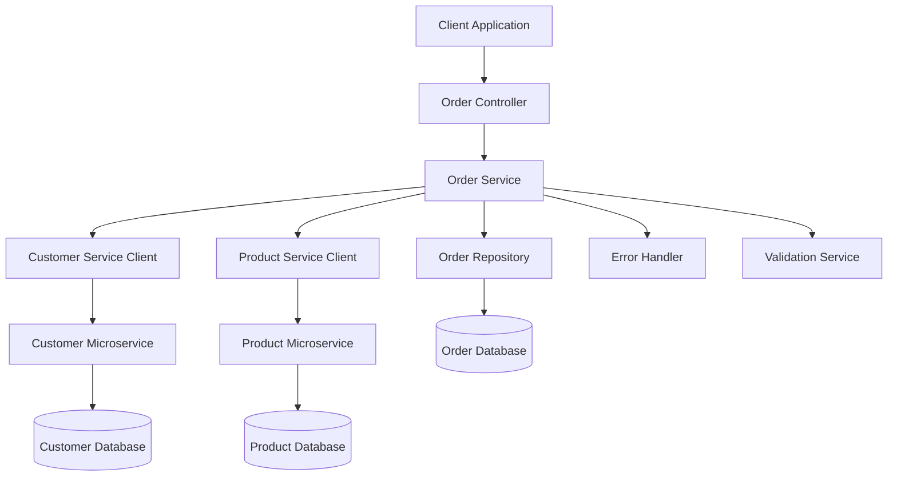

# Design Document

## Overview

This design completes the Order microservice implementation to work seamlessly with the existing Customer and Product microservices in a distributed e-commerce system. The order service will handle order creation, validation, inventory management, and provide comprehensive order management functionality while maintaining proper error handling and service communication patterns.

The design builds upon the existing Spring Boot architecture with JPA entities, DTOs, service layer, and REST controllers, extending it with external service communication, enhanced validation, and comprehensive error handling.

## Architecture

### High-Level Architecture



### Service Communication Pattern

The order service will communicate with external services using HTTP clients with the following pattern:
- **Customer Service**: Validate customer existence and retrieve customer details
- **Product Service**: Validate products, check inventory, and handle purchase transactions
- **Error Handling**: Graceful handling of external service failures with appropriate fallbacks

## Components and Interfaces

### 1. Enhanced Data Models

#### Order Entity Extensions
- Add `orderReference` field for unique order identification
- Add `totalAmount` field for calculated order total
- Add `createdAt` and `updatedAt` timestamps
- Enhance status management with proper enum values
- Add validation annotations

#### OrderLine Entity Extensions  
- Add validation for quantity and price
- Enhance relationship mapping with Order entity

#### New DTOs
- **CustomerResponse**: For customer service integration
- **ProductValidationRequest/Response**: For product validation
- **OrderSummaryResponse**: For enriched order details with customer and product info

### 2. External Service Clients

#### CustomerServiceClient
```java
@Component
public class CustomerServiceClient {
    ResponseEntity<Boolean> existsById(String customerId);
    ResponseEntity<CustomerResponse> findById(String customerId);
}
```

#### ProductServiceClient  
```java
@Component
public class ProductServiceClient {
    ResponseEntity<List<ProductPurchaseResponse>> purchaseProducts(List<ProductPurchaseRequest> request);
    ResponseEntity<ProductResponse> findById(Long productId);
}
```

### 3. Enhanced Service Layer

#### OrderService Extensions
- **createOrder()**: Enhanced with customer validation, product validation, inventory updates
- **getOrderById()**: Enhanced with customer and product details enrichment
- **getOrdersByCustomerId()**: New method for customer-specific orders
- **updateOrderStatus()**: New method for order status management
- **cancelOrder()**: New method with inventory restoration

#### ValidationService
```java
@Service
public class ValidationService {
    void validateCustomer(Long customerId);
    void validateProducts(List<OrderLineRequest> orderLines);
    void validateOrderStatusTransition(String currentStatus, String newStatus);
}
```

### 4. Error Handling System

#### Custom Exceptions
- **CustomerNotFoundException**: When customer validation fails
- **ProductNotFoundException**: When product validation fails  
- **InsufficientInventoryException**: When inventory is insufficient
- **InvalidOrderStatusException**: When status transitions are invalid
- **ExternalServiceException**: When external service calls fail

#### Global Exception Handler
Following the existing pattern from product service, implement comprehensive error handling with:
- Structured error responses
- Business error codes
- Field-level validation errors
- External service failure handling

### 5. Enhanced Controllers

#### OrderController Extensions
- Add validation annotations to request parameters
- Implement pagination for order listing
- Add filtering capabilities (by status, customer, date range)
- Enhanced error response handling

## Data Models

### Enhanced Order Entity
```java
@Entity
@Table(name = "orders")
public class Order {
    @Id
    @GeneratedValue(strategy = GenerationType.IDENTITY)
    private Long id;
    
    @Column(unique = true, nullable = false)
    private String orderReference;
    
    @NotNull
    private Long customerId;
    
    @Enumerated(EnumType.STRING)
    private OrderStatus status;
    
    @Column(precision = 10, scale = 2)
    private BigDecimal totalAmount;
    
    @CreationTimestamp
    private LocalDateTime createdAt;
    
    @UpdateTimestamp  
    private LocalDateTime updatedAt;
    
    @OneToMany(mappedBy = "order", cascade = CascadeType.ALL, orphanRemoval = true)
    private List<OrderLine> orderLines;
}
```

### Order Status Enum
```java
public enum OrderStatus {
    PENDING, CONFIRMED, SHIPPED, DELIVERED, CANCELLED
}
```

### Enhanced DTOs
```java
public class OrderResponse {
    private Long id;
    private String orderReference;
    private Long customerId;
    private CustomerResponse customer; // Enriched customer details
    private OrderStatus status;
    private BigDecimal totalAmount;
    private LocalDateTime createdAt;
    private List<OrderLineResponse> orderLines;
}

public class OrderLineResponse {
    private Long productId;
    private ProductResponse product; // Enriched product details
    private Integer quantity;
    private BigDecimal price;
    private BigDecimal lineTotal;
}
```

## Error Handling

### Error Response Structure
Following the existing pattern:
```java
public class ErrorResponse {
    private Integer businessErrorCode;
    private String businessErrorDescription;
    private String error;
    private Map<String, String> errors; // Field-level validation errors
}
```

### Business Error Codes
```java
public enum OrderErrorCodes {
    ORDER_NOT_FOUND(600, "Order not found"),
    CUSTOMER_NOT_FOUND(601, "Customer not found"),
    PRODUCT_NOT_FOUND(602, "Product not found"),
    INSUFFICIENT_INVENTORY(603, "Insufficient inventory"),
    INVALID_STATUS_TRANSITION(604, "Invalid order status transition"),
    EXTERNAL_SERVICE_ERROR(605, "External service unavailable");
}
```

### Exception Handling Strategy
1. **Validation Errors**: Return 400 Bad Request with field-level details
2. **Not Found Errors**: Return 404 Not Found with specific error codes
3. **Business Logic Errors**: Return 400 Bad Request with business error codes
4. **External Service Errors**: Return 503 Service Unavailable with retry information
5. **Internal Errors**: Return 500 Internal Server Error with generic message

## Testing Strategy

### Unit Testing
- **Service Layer**: Mock external service clients, test business logic
- **Controller Layer**: Mock service layer, test request/response handling
- **Validation**: Test all validation scenarios and error cases
- **Mappers**: Test entity-DTO conversions

### Integration Testing
- **Database Integration**: Test repository operations with test containers
- **External Service Integration**: Test with WireMock for service simulation
- **End-to-End**: Test complete order workflows

### Test Coverage Areas
1. **Order Creation Flow**: Customer validation, product validation, inventory updates
2. **Order Retrieval**: Single order, multiple orders, filtering, pagination
3. **Order Status Management**: Valid transitions, invalid transitions
4. **Error Scenarios**: External service failures, validation failures, not found cases
5. **Data Integrity**: Concurrent order creation, inventory consistency

### Testing Tools
- **JUnit 5**: Unit testing framework
- **Mockito**: Mocking framework for external dependencies
- **TestContainers**: Database integration testing
- **WireMock**: External service simulation
- **Spring Boot Test**: Integration testing support

## Implementation Considerations

### Service Communication
- **HTTP Client Configuration**: Timeouts, retry policies, circuit breakers
- **Service Discovery**: Integration with existing service registry if available
- **Load Balancing**: Client-side load balancing for external services

### Performance Optimization
- **Database Indexing**: Proper indexes on customerId, status, createdAt
- **Caching**: Cache customer and product data for frequently accessed orders
- **Pagination**: Implement efficient pagination for large order lists

### Security Considerations
- **Input Validation**: Comprehensive validation of all input parameters
- **Data Sanitization**: Prevent injection attacks
- **Error Information**: Avoid exposing sensitive information in error messages

### Monitoring and Logging
- **Structured Logging**: Log all external service calls and business operations
- **Metrics**: Track order creation rates, success/failure rates, response times
- **Health Checks**: Monitor external service connectivity